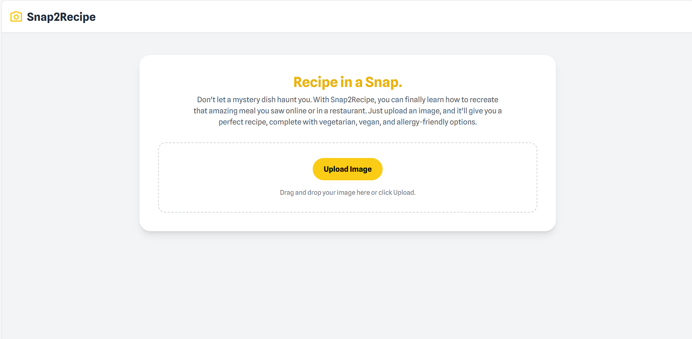

# Snap2Recipe – Image-to-Recipe Finder

**Snap2Recipe** is an AI-powered application that transforms food images into complete, structured recipes. Built with a modern, responsive frontend and powered by advanced computer vision and generative AI models, it demonstrates how data-driven systems can be applied in real-world scenarios to deliver intelligent, user-centric solutions.

## Demo Video

## How it Works

* Upload a food image to identify the dish with AI assistance
* Generate a structured recipe with title, summary, cook time, servings, ingredients, and step-by-step instructions
* View confidence scores and alternative predictions for reliability and transparency
* Customize recipes to fit dietary needs (vegetarian, vegan, or allergy-safe)
* Intuitive, responsive design with TailwindCSS and Google Fonts
* Integrated loading animations and scrollable recipe views for improved usability

## Tech Stack

* **Frontend:** HTML, TailwindCSS, JavaScript
* **AI/ML API:** Google Gemini API (Vision + Text generation)
* **Hosting:** Deployable via GitHub Pages, Vercel, or Netlify
* * **Fonts & Icons:** Google Fonts (Spline Sans), Material Symbols

## How It Works

1. A user uploads an image of a dish.
2. The system processes the image using **Gemini’s multimodal AI** to detect the food item.
3. AI generates predictions with a confidence score and alternative possibilities.
4. A detailed recipe is returned, including structured fields (ingredients, instructions, cook time, servings).
5. The recipe can be further refined based on dietary requirements.

## Features

* Showcases **computer vision** for image classification and **natural language generation** for structured outputs.
* Highlights model reliability through confidence scoring and alternative predictions.
* Can be used into **dietary recommendation systems** for personalized nutrition.
* Useful for recipe platforms, cooking apps, or health startups targeting customized meal planning.
* A practical case study for understanding **multimodal AI applications**.

   * Or deploy via GitHub Pages / Netlify / Vercel for live hosting.

---

Would you like me to also add a **"Future Enhancements" section** (like multi-language support, nutritional breakdown, or mobile PWA), so it reads like a forward-looking project in your portfolio?
